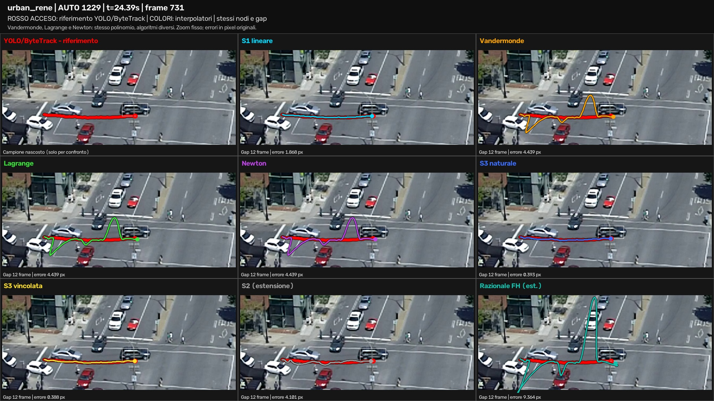

# Trajectory Reconstruction from Video Using Numerical Interpolation

This project reconstructs missing vehicle positions in fixed-camera traffic
videos using numerical interpolation. The complete pipeline combines object
detection, tracking, interpolation, road-plane calibration, and kinematic
analysis.

> **Main conclusion:** for the evaluated scenes and masking protocol, the
> piecewise-linear **S1 interpolant** gives the best overall compromise
> between position accuracy, kinematic accuracy, stability, and cost.

## Project overview

| Component | Configuration |
|---|---|
| Input | 2 complete Urban Tracker traffic videos |
| Detection and tracking | YOLO11n + ByteTrack |
| Main benchmark | 5,517 shared gaps, 3/6/12/24 hidden frames |
| Visible support | 4 observations before and 4 after each gap |
| Interpolation methods | 8 methods |
| Pixel evaluations | 44,136, with no numerical failures |
| Metric evaluations | 406 gaps inside the calibrated road areas |
| Kinematic quantities | speed, acceleration, and heading |

## Workflow

```text
video
  -> object detection and tracking
  -> observed vehicle trajectories
  -> controlled masking of samples
  -> interpolation of missing positions
  -> pixel-space evaluation
  -> road-plane calibration
  -> metric-space and kinematic evaluation
```

The trajectory point is the bottom centre of each detected bounding box:

$$
u=\frac{u_{\min}+u_{\max}}{2},\qquad v=v_{\max}.
$$

YOLO11n detects vehicles and ByteTrack assigns identities over time. The
protocol is post-tracking: identities are assigned before samples are hidden.
The reference is therefore a YOLO/ByteTrack reference, not independent manual
ground truth.

## Results

### Position reconstruction

S1 is the best method for ADE and RMS over the tested video gaps. Natural S3
and clamped S3 are close alternatives with smoother trajectories. Vandermonde,
Lagrange, and Newton are different implementations of the same polynomial on
the same nodes; their accuracy is therefore identical up to floating-point
rounding. S2 and Floater-Hormann are project extensions.

<p align="center">
  
</p>

<p align="center">
  <em>One vehicle passage, one reference trajectory in red, and the
  interpolation methods shown in synchronized panels.</em>
</p>

| Pixel benchmark | Metric benchmark |
|---|---|
|  |  |

The metric benchmark is restricted to the 406 gaps for which every visible
support point and hidden reference point lies inside the calibrated road area.
The metric reference is the projection of YOLO/ByteTrack observations, not GPS.

### Node distribution and calibration

| Runge/Chebyshev experiment | Valid calibration areas |
|---|---|
|  |  |

The Runge experiment shows why equally spaced nodes can produce strong
oscillations for high-degree global polynomials. Chebyshev nodes reduce this
effect. The calibration image shows the part of each camera view where the
road-plane mapping is considered valid.

## Kinematic analysis

Speed, acceleration, and heading are derived from the interpolated East and
North coordinates. A separate interpolant is not fitted to speed or heading:

$$
v_E(t)=E'(t),\qquad v_N(t)=N'(t),\qquad
V(t)=\sqrt{v_E(t)^2+v_N(t)^2}
$$

$$
\theta(t)=
\left[
\frac{180}{\pi}\mathrm{atan2}(v_E(t),v_N(t))+360
\right]\mathbin{\%}360
$$

```python
v_e = model_e.derivative(query_times, order=1)
v_n = model_n.derivative(query_times, order=1)
a_e = model_e.derivative(query_times, order=2)
a_n = model_n.derivative(query_times, order=2)
speed = np.hypot(v_e, v_n)
heading = (np.degrees(np.arctan2(v_e, v_n)) + 360) % 360
heading[speed < 0.5] = np.nan
```

The evaluation uses the 406 valid metric gaps. The reference is computed with
finite differences on the complete projected trajectory, so it is a descriptive
YOLO/ByteTrack-based estimate rather than independent GPS or inertial ground
truth. Heading is ignored below 0.5 m/s, where its direction is unstable.

For 24-frame gaps:

| Method | Velocity MAE (m/s) | Acceleration MAE (m/s²) | Heading MAE (°) |
|---|---:|---:|---:|
| S1 | 0.7607 | 19.5135 | 24.2816 |
| Natural S3 | 0.9262 | 20.0055 | 26.9254 |
| Clamped S3 | 0.9276 | 20.0034 | 26.9037 |
| S2 (extension) | 1.4928 | 21.6733 | 35.2215 |
| Vandermonde / Lagrange / Newton | 8.7811 | 90.9516 | 69.3162 |
| Floater-Hormann (extension) | 27.1535 | 271.3230 | 81.0957 |

See the [complete kinematics report](docs/kinematics_results.md).

## Error metrics

For a hidden reference position $P_i$ and reconstructed position
$\widehat P_i$, define the Euclidean error
$e_i=\lVert P_i-\widehat P_i\rVert_2$.

$$
\mathrm{ADE}=\frac{1}{M}\sum_{i=1}^{M}e_i
$$

**ADE (Average Displacement Error)** is the mean positional error over all
hidden samples. It has the same unit as the position, pixels or metres, and is
an intuitive measure of the typical reconstruction error.

$$
\mathrm{RMS}_P=\sqrt{\frac{1}{M}\sum_{i=1}^{M}e_i^2}
$$

**RMS (Root Mean Square)** also has units of pixels or metres, but gives more
weight to large errors because each error is squared before averaging. It is
therefore useful for detecting oscillations or occasional severe failures.
Always $\mathrm{RMS}_P\geq\mathrm{ADE}$; equality holds when all errors have
the same magnitude.

## Methods

### Methods from the course

- Vandermonde matrix and monomial-basis interpolation;
- Lagrange polynomials;
- Newton form, divided differences, and Horner evaluation;
- piecewise-linear S1 spline;
- natural and clamped cubic S3 splines;
- periodic cubic splines;
- Chebyshev nodes;
- trigonometric interpolation for periodic data.

### Project extensions

- quadratic S2 spline;
- Floater-Hormann barycentric rational interpolation;
- real-video benchmark and controlled masking;
- road-plane calibration and metric coordinates;
- speed, acceleration, and heading evaluation.

## Data and experimental protocol

| Scene | Frames | Approximate duration |
|---|---:|---:|
| Sherbrooke | 4,000 | 2 min 13 s |
| René-Levesque | 8,501 | 4 min 44 s |

Each track is evaluated using shared masks with gaps of 3, 6, 12, and 24
frames. Four visible observations are retained on each side of a gap. Hidden
samples are never used as support points for another fit.

The road-plane mapping converts image coordinates to local East/North metric
coordinates. It is valid only for the calibrated road surface and image area.
The metric comparison includes 406 complete gaps; the remaining gaps are
outside the valid calibration domain.

## Repository structure

```text
.
├── relazione_progetto.pdf       # Final report
├── src/                         # Pipeline and benchmark code
├── tests/                       # Numerical and geometric tests
├── configs/                     # Experiment configurations
├── calibration/                 # Calibration files and templates
├── data/                        # Local datasets and generated results
├── docs/                        # Documentation and tracked README assets
├── reports/latex/               # LaTeX source and Overleaf package
└── models/                      # Local YOLO model files
```

Large datasets, generated videos, models, caches, and full generated reports
are intentionally excluded by `.gitignore`. Lightweight plots, the preview
image, and Markdown result summaries used by this README are stored under
`docs/` so they remain visible on GitHub.

## Reproduction

From the repository root:

```bash
pip install -r docs/requirements.txt

python3 -m unittest discover -s tests -v

python3 -m src.benchmark
python3 -m src.course_experiments
python3 -m src.passage_clips
python3 -m src.course_report --verify-clips

python3 -m src.project_ground
python3 -m src.metric_benchmark
python3 -m src.kinematic_benchmark
python3 -m src.ground_report

python3 reports/latex/build_report.py
```

Video tracking and encoding may require FFmpeg, CUDA, and NVENC. See the
[pipeline execution guide](docs/esecuzione.md) for operational details.

## Documentation and reports

- [Final PDF report](relazione_progetto.pdf)
- [Methods and experiments](docs/metodi_ed_esperimenti.md)
- [Road-plane calibration](docs/calibrazione.md)
- [Pipeline execution](docs/esecuzione.md)
- [Fixed-camera video analysis](docs/video_camera_fissa.md)
- [Pixel benchmark summary](docs/pixel_benchmark_results.md)
- [Metric benchmark summary](docs/metric_benchmark_results.md)
- [Kinematic benchmark summary](docs/kinematics_results.md)
- [LaTeX report source](reports/latex/relazione_progetto.tex)

## Limitations

- YOLO/ByteTrack observations are a reference signal, not independent manual
  annotations.
- Calibration is valid only inside the selected road-plane area.
- Calibration residuals do not replace independent control checkpoints.
- Heading and acceleration are more sensitive to noise than position.
- Quantitative conclusions apply to the two scenes, masks, and configurations
  used in this experiment.
