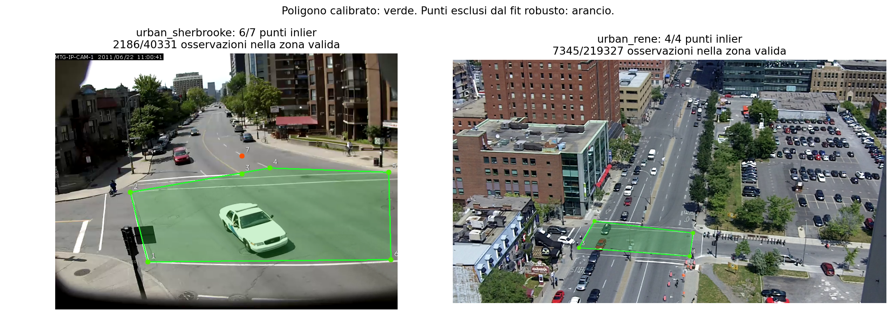
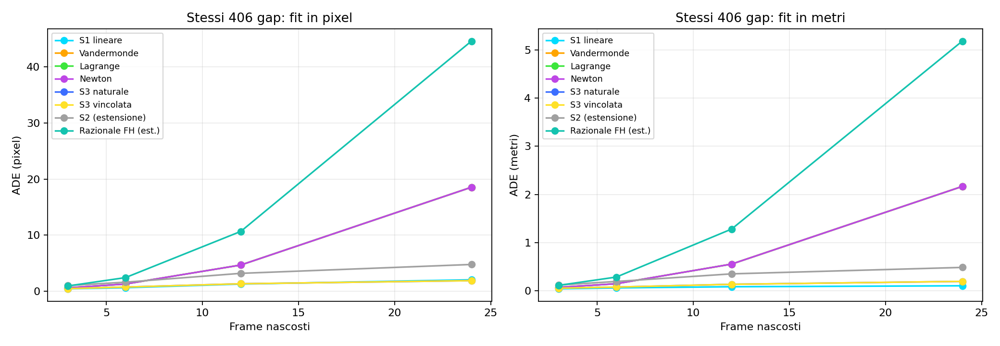

# Piano stradale calibrato: primo confronto metrico

Gap validi: **406/5517**; esclusi: 5111.
Il dominio valido copre una parte dei filmati, non tutta l'immagine. Le osservazioni esterne sono escluse.
La baseline in pixel usa gli stessi gap ammessi dal confronto in metri.

## Calibrazioni

| Scena | Punti | Inlier | RMS del fit (m) | Osservazioni valide |
|---|---:|---:|---:|---:|
| urban_sherbrooke | 7 | 6 | 0.280155 | 2186 / 40331 |
| urban_rene | 4 | 4 | 1.58276e-14 | 7345 / 219327 |

Il residuo del fit non è una misura indipendente di accuratezza. Con quattro punti può essere quasi nullo.
Non sono ancora stati forniti punti indipendenti di verifica in questo run.

## Risultati metrici

| Metodo | Gap | ADE (m) | RMS (m) |
|---|---:|---:|---:|
| Lagrange | 3 | 0.07489 | 0.09704 |
| Lagrange | 6 | 0.15055 | 0.21553 |
| Lagrange | 12 | 0.55757 | 0.83226 |
| Lagrange | 24 | 2.16725 | 3.46132 |
| Newton | 3 | 0.07489 | 0.09704 |
| Newton | 6 | 0.15055 | 0.21553 |
| Newton | 12 | 0.55757 | 0.83226 |
| Newton | 24 | 2.16725 | 3.46132 |
| Razionale FH (est.) | 3 | 0.11660 | 0.15233 |
| Razionale FH (est.) | 6 | 0.28851 | 0.44736 |
| Razionale FH (est.) | 12 | 1.28398 | 1.98352 |
| Razionale FH (est.) | 24 | 5.17970 | 9.17381 |
| S1 lineare | 3 | 0.04496 | 0.06409 |
| S1 lineare | 6 | 0.06421 | 0.09666 |
| S1 lineare | 12 | 0.08784 | 0.14266 |
| S1 lineare | 24 | 0.10746 | 0.16442 |
| S2 (estensione) | 3 | 0.12309 | 0.16742 |
| S2 (estensione) | 6 | 0.19701 | 0.30106 |
| S2 (estensione) | 12 | 0.35476 | 0.51022 |
| S2 (estensione) | 24 | 0.48845 | 0.77819 |
| S3 vincolata | 3 | 0.05699 | 0.07514 |
| S3 vincolata | 6 | 0.08101 | 0.11013 |
| S3 vincolata | 12 | 0.13860 | 0.20354 |
| S3 vincolata | 24 | 0.19916 | 0.29889 |
| S3 naturale | 3 | 0.05697 | 0.07510 |
| S3 naturale | 6 | 0.08103 | 0.11017 |
| S3 naturale | 12 | 0.13855 | 0.20338 |
| S3 naturale | 24 | 0.19870 | 0.29792 |
| Vandermonde | 3 | 0.07489 | 0.09704 |
| Vandermonde | 6 | 0.15055 | 0.21553 |
| Vandermonde | 12 | 0.55757 | 0.83226 |
| Vandermonde | 24 | 2.16725 | 3.46132 |

Il riferimento è YOLO/ByteTrack proiettato tramite omografia, non un GPS indipendente delle auto. La valutazione cinematica è riportata separatamente in KINEMATICS.md.
