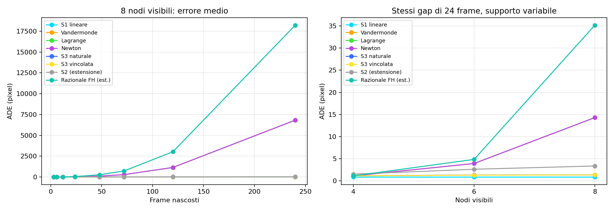
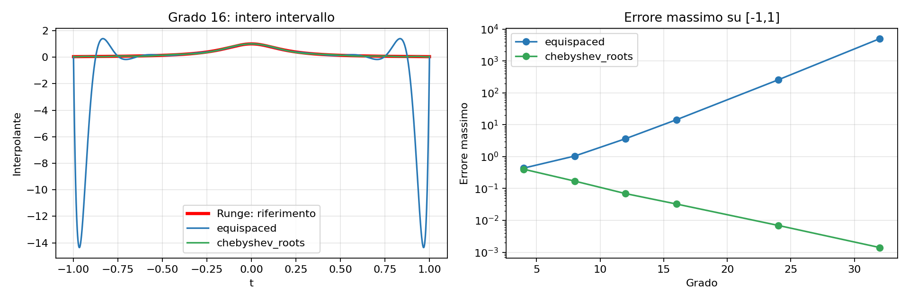
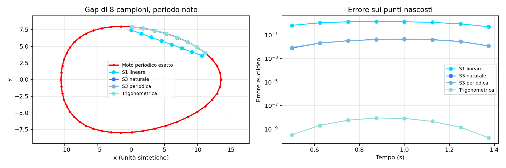

# Confronto dei metodi del corso e clip dei passaggi

- 8 metodi nel benchmark stradale, 2148 gap, 17184 valutazioni.
- Fallimenti numerici: 0; maschere salvate riutilizzate: False.
- 12 clip di passaggi, durata 6.40–8.01 s, codificate con NVENC.
- Ogni clip: riferimento YOLO/ByteTrack rosso acceso, zoom fisso e un riquadro per interpolatore.
- Le clip sono illustrative e selezionate per movimento e distribuzione temporale, indipendentemente dagli errori. Le metriche coprono tutti i casi ammissibili dei video completi.

Le clip video complete non sono incluse nella repository GitHub perché sono
file generati di grandi dimensioni. È disponibile una [anteprima multi-metodo
tracciata](assets/multimethod_interpolation_clip.jpg).

## Metodi

Vandermonde (sistema monomiale), Lagrange (formula diretta), Newton (differenze divise e Horner), S1, S3 naturale e S3 vincolata costituiscono il nucleo trattato nelle slide.
La S3 vincolata stima le derivate ai bordi dai primi/ultimi tre campioni visibili. Non usa velocità ricavate dai punti nascosti.
S2 è un'estensione dalla definizione generale di spline. La famiglia razionale è introdotta nelle slide; la specifica costruzione Floater–Hormann, parametro d=3, è un'estensione esterna esplicitamente indicata.

## Risultati sui video, 8 nodi

| Metodo | Gap | ADE (px) | RMS (px) | Fit mediano (ms) | Fallimenti |
|---|---:|---:|---:|---:|---:|
| Lagrange | 3 | 0.5088 | 0.6983 | 0.0992 | 0 |
| Lagrange | 6 | 1.1545 | 1.7492 | 0.0999 | 0 |
| Lagrange | 12 | 4.2135 | 10.5720 | 0.0983 | 0 |
| Lagrange | 24 | 18.9447 | 33.4093 | 0.1003 | 0 |
| Lagrange | 48 | 101.8808 | 188.7232 | 0.1014 | 0 |
| Lagrange | 72 | 277.0082 | 488.6295 | 0.1051 | 0 |
| Lagrange | 120 | 1142.5919 | 2341.3403 | 0.1018 | 0 |
| Lagrange | 240 | 6819.7511 | 11704.6460 | 0.1038 | 0 |
| Newton | 3 | 0.5088 | 0.6983 | 0.0460 | 0 |
| Newton | 6 | 1.1545 | 1.7492 | 0.0461 | 0 |
| Newton | 12 | 4.2135 | 10.5720 | 0.0460 | 0 |
| Newton | 24 | 18.9447 | 33.4093 | 0.0465 | 0 |
| Newton | 48 | 101.8808 | 188.7232 | 0.0467 | 0 |
| Newton | 72 | 277.0082 | 488.6295 | 0.0494 | 0 |
| Newton | 120 | 1142.5919 | 2341.3403 | 0.0502 | 0 |
| Newton | 240 | 6819.7511 | 11704.6460 | 0.0532 | 0 |
| Razionale FH (est.) | 3 | 0.8018 | 1.1072 | 0.1680 | 0 |
| Razionale FH (est.) | 6 | 2.2159 | 3.3968 | 0.1664 | 0 |
| Razionale FH (est.) | 12 | 9.4936 | 26.2621 | 0.1717 | 0 |
| Razionale FH (est.) | 24 | 46.4790 | 85.8264 | 0.1719 | 0 |
| Razionale FH (est.) | 48 | 261.9474 | 516.9439 | 0.1752 | 0 |
| Razionale FH (est.) | 72 | 718.3288 | 1343.7377 | 0.1779 | 0 |
| Razionale FH (est.) | 120 | 3029.1047 | 6577.1603 | 0.1714 | 0 |
| Razionale FH (est.) | 240 | 18220.9100 | 33259.4248 | 0.1719 | 0 |
| S1 lineare | 3 | 0.3513 | 0.6301 | 0.0899 | 0 |
| S1 lineare | 6 | 0.5705 | 1.3533 | 0.0915 | 0 |
| S1 lineare | 12 | 0.7855 | 1.7770 | 0.0871 | 0 |
| S1 lineare | 24 | 1.2413 | 3.1589 | 0.0908 | 0 |
| S1 lineare | 48 | 2.9898 | 8.8722 | 0.0881 | 0 |
| S1 lineare | 72 | 4.8868 | 14.4159 | 0.0938 | 0 |
| S1 lineare | 120 | 7.8804 | 21.9145 | 0.0893 | 0 |
| S1 lineare | 240 | 11.0161 | 27.1348 | 0.0856 | 0 |
| S2 (estensione) | 3 | 0.8633 | 1.2397 | 0.0672 | 0 |
| S2 (estensione) | 6 | 1.4999 | 2.4729 | 0.0674 | 0 |
| S2 (estensione) | 12 | 2.3394 | 3.7042 | 0.0678 | 0 |
| S2 (estensione) | 24 | 4.5059 | 7.5374 | 0.0678 | 0 |
| S2 (estensione) | 48 | 8.4972 | 14.8758 | 0.0715 | 0 |
| S2 (estensione) | 72 | 11.7482 | 22.0471 | 0.0724 | 0 |
| S2 (estensione) | 120 | 19.0089 | 39.8497 | 0.0734 | 0 |
| S2 (estensione) | 240 | 25.8366 | 45.8191 | 0.0727 | 0 |
| S3 vincolata | 3 | 0.3890 | 0.5444 | 0.5465 | 0 |
| S3 vincolata | 6 | 0.6402 | 1.0908 | 0.5486 | 0 |
| S3 vincolata | 12 | 1.0361 | 2.1687 | 0.5552 | 0 |
| S3 vincolata | 24 | 1.8365 | 2.9180 | 0.5584 | 0 |
| S3 vincolata | 48 | 3.4446 | 7.0139 | 0.5656 | 0 |
| S3 vincolata | 72 | 5.0817 | 9.9186 | 0.5740 | 0 |
| S3 vincolata | 120 | 7.5269 | 15.4940 | 0.5687 | 0 |
| S3 vincolata | 240 | 11.1840 | 19.1123 | 0.6233 | 0 |
| S3 naturale | 3 | 0.3891 | 0.5445 | 0.2676 | 0 |
| S3 naturale | 6 | 0.6400 | 1.0909 | 0.2677 | 0 |
| S3 naturale | 12 | 1.0348 | 2.1612 | 0.2667 | 0 |
| S3 naturale | 24 | 1.8345 | 2.9122 | 0.2696 | 0 |
| S3 naturale | 48 | 3.4431 | 7.0166 | 0.2788 | 0 |
| S3 naturale | 72 | 5.0748 | 9.9057 | 0.2783 | 0 |
| S3 naturale | 120 | 7.5183 | 15.4943 | 0.2774 | 0 |
| S3 naturale | 240 | 11.1780 | 19.0938 | 0.3042 | 0 |
| Vandermonde | 3 | 0.5088 | 0.6983 | 0.0669 | 0 |
| Vandermonde | 6 | 1.1545 | 1.7492 | 0.0662 | 0 |
| Vandermonde | 12 | 4.2135 | 10.5720 | 0.0635 | 0 |
| Vandermonde | 24 | 18.9447 | 33.4093 | 0.0665 | 0 |
| Vandermonde | 48 | 101.8808 | 188.7232 | 0.0675 | 0 |
| Vandermonde | 72 | 277.0082 | 488.6295 | 0.0686 | 0 |
| Vandermonde | 120 | 1142.5919 | 2341.3403 | 0.0695 | 0 |
| Vandermonde | 240 | 6819.7511 | 11704.6460 | 0.0705 | 0 |

I tempi sono misure descrittive di singoli fit, aggregate su molte prove; includono le due coordinate. Il calcolo del condizionamento è escluso dall'intervallo cronometrato.
Il condizionamento esportato si riferisce alla matrice monomiale sul tempo normalizzato, non a ogni famiglia di interpolatori. L'eccesso rispetto al rettangolo dei nodi di supporto è un indicatore geometrico, non un errore fisico.

## Equivalenza delle formulazioni polinomiali

- Vandermonde / lagrange: 70485 punti confrontati, differenza euclidea massima **1.709e-06 pixel**.
- Vandermonde / newton: 70485 punti confrontati, differenza euclidea massima **1.682e-06 pixel**.

Con gli stessi nodi i tre metodi rappresentano lo stesso polinomio. Le oscillazioni rispetto al riferimento non si risolvono semplicemente passando da una formulazione all'altra.

## Esperimenti dedicati

- **Chebyshev/Runge:** gradi 4, 8, 12, 16, 24 e 32; n+1 nodi equispaziati o radici esatte di Chebyshev. Valutazione matematica su [-1,1], comprese le piccole fasce esterne alle radici; nessun accesso ai dati video nascosti.
- **Periodicità:** traiettoria analitica chiusa con periodo noto; S3 periodica e interpolazione trigonometrica confrontate con S1 e S3 naturale. Per i campioni mancanti si risolve il sistema trigonometrico, non si applica direttamente una FFT alla griglia incompleta.
- **Supporto:** 4, 6 e 8 osservazioni visibili sugli stessi punti nascosti. Per i polinomi corrispondono a gradi massimi 3, 5 e 7. Le maschere derivate mantengono l'esclusione globale dei campioni nascosti.

La trigonometrica può riprodurre quasi esattamente il segnale sintetico perché questo appartiene alla base scelta. Ciò non dimostra superiorità sui video di traffico non periodici.
Le ricostruzioni stradali sono riferite a output YOLO/ByteTrack post-tracking, non a posizioni fisiche esatte o identità manualmente validate.
